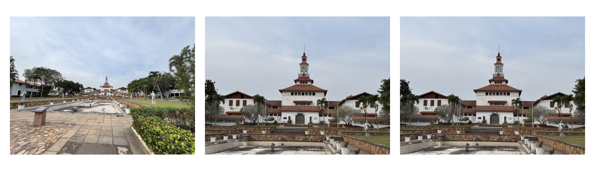
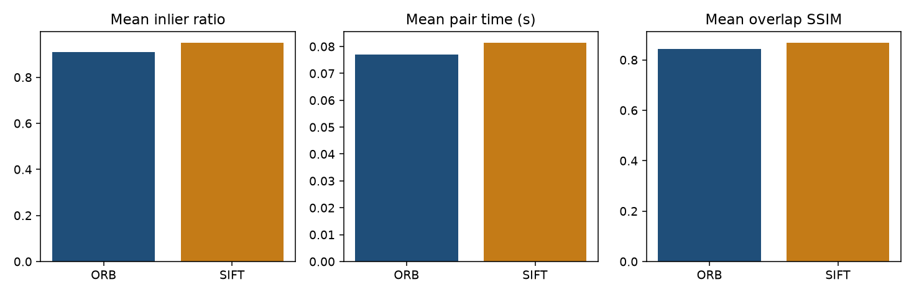
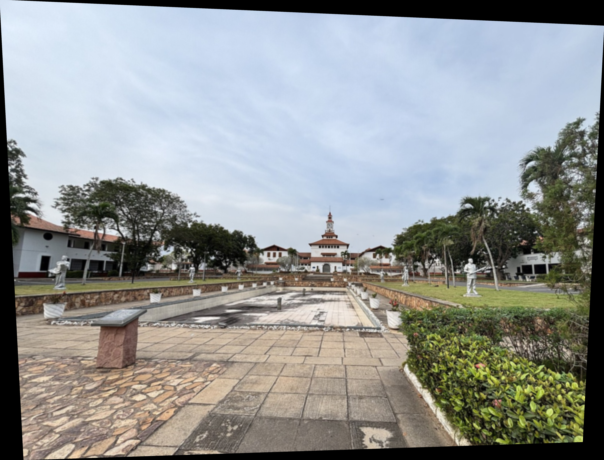
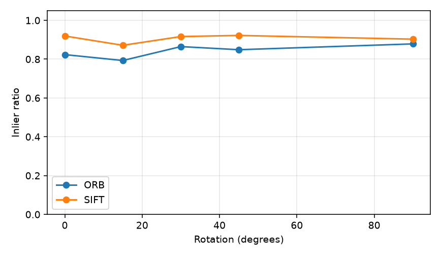
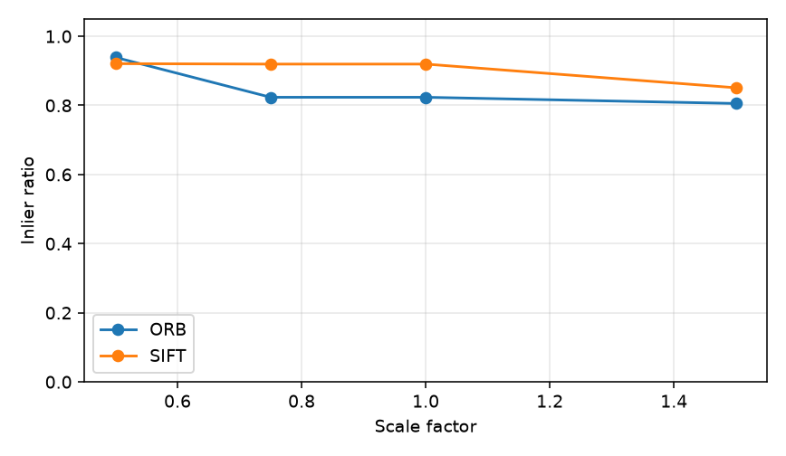
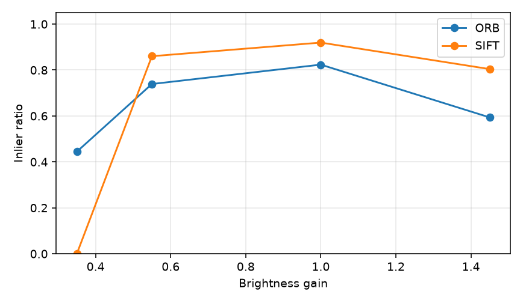
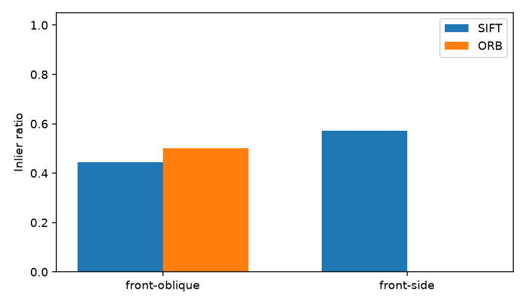
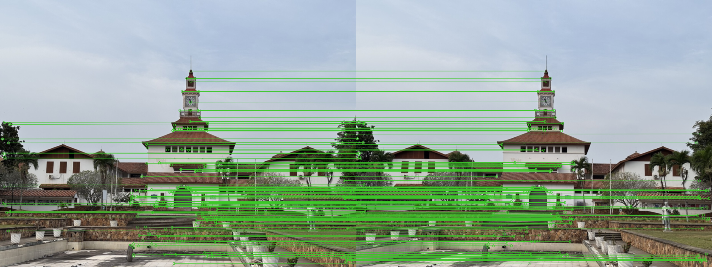
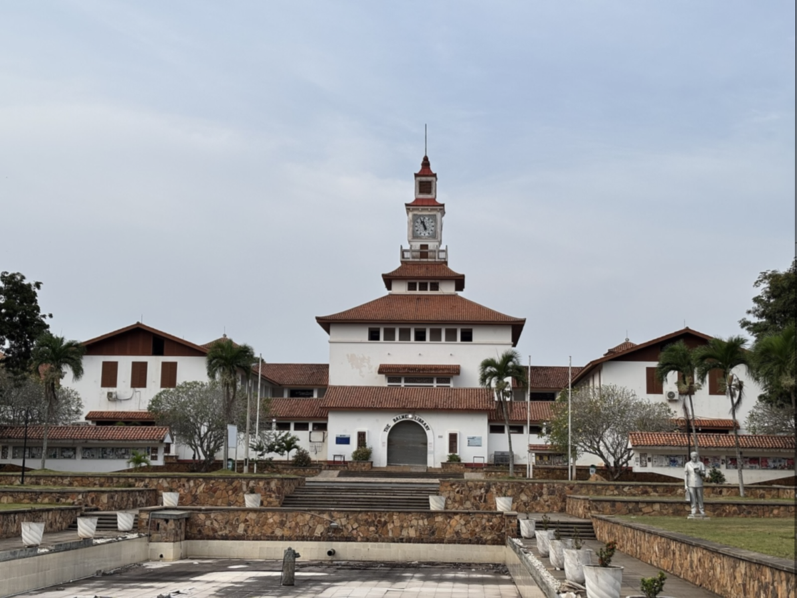

# Feature-based image matching and automatic panorama construction

The typeset PDF is produced from the CVPR LaTeX source [`main.tex`](main.tex) (`python scripts/build_report.py`). This Markdown file is a prose draft of the same content.

**Shadrack Bentil**  
Department of Computer Science, University of Ghana, Legon  
sbentil005@st.ug.edu.gh

## Abstract

This report describes a classical computer-vision system that identifies corresponding regions in overlapping photographs and combines them into a panorama. Keypoints are detected and described with SIFT and with ORB, matched by k-nearest neighbours and Lowe's ratio test, and filtered with RANSAC to estimate a homography. Every view is warped into the coordinate system of the middle image and the overlap is feather-blended. The implementation uses OpenCV primitives only: it does not call a high-level stitcher or a pretrained recogniser. On a controlled five-image mural with about 50% overlap, both detectors produce a complete panorama. Mean inlier ratios are similar (about 0.73), but SIFT is the tighter geometric estimator (mean reprojection error about 0.06 px versus about 0.4 px for ORB) while ORB is faster. Both methods fail when brightness is crushed to a gain of 0.35, and viewpoint change off the plane raises reprojection error above 2 px. An interactive application exposes every stage of the pipeline.

## 1. Introduction

A panorama is a single wide image assembled from several photographs of the same scene. Consumer cameras hide the geometry: they find the same landmarks in neighbouring frames, discard inconsistent correspondences, and warp one frame onto another. Those steps are standard computer vision — feature detection, description, matching, robust homography estimation, and blending — rather than a learned recogniser.

This project implements that chain explicitly. The objectives are:

1. Detect distinctive keypoints and compute descriptors with two established methods, SIFT and ORB.
2. Match descriptors between overlapping pairs and visualise correspondences before and after RANSAC.
3. Estimate a homography, warp images into one coordinate system, and stitch a panorama from at least three views.
4. Compare the detectors on keypoint count, match count, inlier count, inlier ratio, processing time, and panorama quality.
5. Measure how rotation, scale, illumination, and viewpoint change affect the inlier ratio.

The contribution is a transparent, reproducible pipeline and a walkthrough interface that makes each geometric decision visible.

## 2. Related work

Scale-invariant feature transform (SIFT) describes a keypoint by a histogram of local gradients and is designed to be stable under scale and rotation [1]. Oriented FAST and rotated BRIEF (ORB) replaces that histogram with a binary descriptor around FAST corners; matching uses Hamming distance and is typically cheaper [2]. Random sample consensus (RANSAC) estimates a parametric model in the presence of outliers by repeatedly fitting a minimal sample and counting inliers [3]. A homography maps a plane in one camera to another, or equivalently maps views related by a pure rotation about the optical centre [4]. Brown and Lowe showed that invariant features plus RANSAC homographies are sufficient to assemble panoramas automatically [5]. OpenCV provides the detectors, matchers, and perspective warp used here [6]. High-level stitchers and learned detectors are intentionally avoided so that each stage remains inspectable.

## 3. Method

The pipeline is:

**overlapping photos → prepare → detect and describe → match → RANSAC → homography → warp to the middle photo → feather blend → panorama.**

**Preparation.** Each image is resized so the long edge is 1200 px, lightly Gaussian-smoothed, and optionally contrast-limited adaptive histogram equalisation (CLAHE) is applied on the grayscale copy used for detection. Colour is kept for warping and blending. CLAHE is justified when illumination varies across the frame; blur suppresses high-frequency noise without deleting corners.

**SIFT versus ORB.** SIFT builds a gradient-histogram descriptor that is designed to be stable under scale and rotation. ORB combines FAST corners with a rotated BRIEF binary descriptor: Hamming matching is fast, but intensity changes scramble the binary tests. Using the same Lowe ratio (0.75) and the same RANSAC threshold (5 px) keeps the comparison fair. Keypoints are capped at 2000 per image.

**Matching.** Brute-force kNN ($k=2$) with Lowe's ratio test. SIFT uses $L_2$; ORB uses Hamming. Cross-check is off so the ratio test remains the only filter before RANSAC.

**RANSAC homography.** A homography is the right model when the scene is approximately planar or the camera rotates about its optical centre. RANSAC is justified because putative matches always contain outliers. Inliers after RANSAC are the correspondences that are trusted.

**Middle image as reference.** Pairwise homographies are composed so that every photo is mapped into the middle photo's frame. Sequential left-to-right warping would accumulate error; a centre reference splits that chain.

**Blending.** After `warpPerspective`, each warped mask is converted to a distance-transform weight and the colours are averaged in the overlap (feathering). This is enough to hide seams without a multi-band pyramid.

Panorama quality is reported as (i) inlier ratio, (ii) mean reprojection error of inliers, and (iii) SSIM on the overlap after warping. High SSIM on the mural is expected: the source is planar, so a homography can align it almost exactly. Real photographs with parallax would score lower.

## 4. Dataset

Four folders live in `data/scenes/`. They are Creative Commons photographs of the University of Ghana, Legon campus, from Wikimedia Commons (Commonwealth Hall, Dance Department, Night Market, Balme Library). Official sites were not copied. The Commons frames were not shot as a dedicated 50% overlap panorama.

| Set | Images | Role |
|---|---|---|
| `scene_main` | 3 Balme Library views | Primary panorama |
| `scene_viewpoint` | Street, courtyard, and street of the Dance Department | Viewpoint change |
| `scene_lighting` | Three Night Market stall views | Related outdoor pair |
| `scene_second` | 5 Commonwealth Hall walk-up views | Extra scene in the app |

Rotation (15°–90°) and scale (0.5×–1.5×) are applied in software to a main pair. Those geometric changes do not require a new capture.



## 5. Implementation

| Module | Responsibility |
|---|---|
| `src/preprocess.py` | Resize, denoise, CLAHE |
| `src/features.py` | SIFT and ORB |
| `src/matching.py` | kNN and Lowe ratio |
| `src/homography.py` | RANSAC `findHomography`, composition, warp |
| `src/stitch.py` | Canvas and feather blend |
| `src/pipeline.py` | Pair matching and multi-image stitch |
| `src/evaluate.py` | Metrics |
| `src/robustness.py` | Rotate, scale, brightness |
| `scripts/run_experiments.py` | Tables and figures |
| `streamlit_app.py` | Interactive walkthrough |

```bash
python scripts/run_experiments.py
python scripts/build_report.py
streamlit run streamlit_app.py
```

## 6. Experimental results

### 6.1 Detector comparison

Numbers are from `report/results/detector_comparison.csv` on `scene_main` consecutive pairs.

| Detector | Pair | Keypoints (L/R) | Initial matches | Inliers | Inlier ratio | Reproj. error (px) | Overlap SSIM | Pair time (s) |
|---|---|---|---|---|---|---|---|---|
| SIFT | 1–2 | 2000 / 2000 | 1301 | 1096 | 0.842 | 0.052 | 0.998 | 0.129 |
| SIFT | 2–3 | 2000 / 2000 | 866 | 615 | 0.710 | 0.065 | 0.997 | 0.073 |
| SIFT | 3–4 | 2000 / 2001 | 1133 | 821 | 0.725 | 0.063 | 0.997 | 0.078 |
| SIFT | 4–5 | 2001 / 2001 | 787 | 514 | 0.653 | 0.071 | 0.998 | 0.072 |
| ORB | 1–2 | 2000 / 2000 | 981 | 793 | 0.808 | 0.316 | 0.997 | 0.123 |
| ORB | 2–3 | 2000 / 2000 | 644 | 410 | 0.637 | 0.485 | 0.994 | 0.028 |
| ORB | 3–4 | 2000 / 2000 | 915 | 727 | 0.795 | 0.407 | 0.997 | 0.030 |
| ORB | 4–5 | 2000 / 2000 | 731 | 510 | 0.698 | 0.411 | 0.997 | 0.029 |

Full five-image stitch: SIFT 0.60 s, ORB 0.43 s. Mean inlier ratios are close (SIFT 0.733, ORB 0.734) on this easy planar scene. The discriminating number is reprojection error: SIFT stays around 0.06 px, ORB around 0.4 px. Both panoramas are visually complete.






### 6.2 Robustness

**Rotation.** Inlier ratio dips at 15°–45° then recovers at 90° (the mural has many axis-aligned windows, so a right angle is a friendly case). SIFT's surviving inliers stay geometrically tight (reprojection about 0.12–0.24 px) while ORB's error sits near 1 px.



**Scale.** At 0.5× both detectors lose matches (SIFT 189 inliers, ORB 155). At 1.5× both recover. SIFT's inlier ratio at native scale is 0.71 versus 0.50 at half size.



**Illumination.** A modest darkening (gain 0.55) is tolerable. At gain 0.35 both methods fail: SIFT 15 inliers, ORB 18. Brightening (gain 1.45) hurts ORB more (inlier ratio 0.39 versus SIFT 0.64). The dedicated lighting pair is an easier shade gradient and both detectors remain healthy.



**Viewpoint.** Front versus oblique or side views drop overlap SSIM from about 1.00 to 0.57–0.74 and raise reprojection error to about 1.4–2.3 px. That is the first experiment that is not a pure plane motion of the mural, and it is where the homography model strains.



### 6.3 Quantitative summary

- **Keypoints** — both detectors hit the 2000 cap; the scene is rich in corners.
- **Initial matches** — SIFT returns more ratio-test survivors on every main pair.
- **RANSAC inliers / inlier ratio** — similar ratios; SIFT usually contributes more inliers in absolute count.
- **Processing time** — ORB is faster after the first pair (binary matching).
- **Panorama quality** — overlay SSIM about 0.997 on the planar mural; mean reprojection error favours SIFT by roughly six to eight times.





The Streamlit application shows the same stages interactively: keypoints, putative matches (outliers in red, inliers in green), inliers only, the warped overlay, and the final panorama.

## 7. Discussion and limitations

1. **Homography assumes a plane (or pure rotation).** Trees, people, or a nearby object with parallax will ghost. The viewpoint set already raises reprojection error above 2 px.
2. **Low overlap.** Pairs 4–5 have the weakest inlier ratio (SIFT 0.65). Below about 30% overlap, RANSAC may not find a consistent homography.
3. **Severe illumination.** Gain 0.35 leaves fewer than 20 inliers — not enough for a stable homography in harder scenes.
4. **Moving objects** in the overlap would generate persistent outliers; RANSAC can ignore some of them, but the blend will still ghost.
5. **Synthetic mural.** Corners are unusually clean, so both detectors look strong. Phone photographs of a courtyard at dusk would widen the SIFT–ORB gap, especially under lighting.
6. **Feather blending** cannot hide large exposure differences or parallax; a multi-band blend would be a natural extension.
7. **Feature budget.** Capping at 2000 keypoints is a speed choice; a textureless wall would need a different detector response threshold, not a higher cap.

## 8. Conclusion

The system demonstrates the full classical chain from overlapping views to a panorama, with SIFT and ORB compared on the metrics listed above. On a well-textured planar scene both detectors stitch a complete five-image panorama; SIFT is the more accurate geometric estimator, ORB is the faster one, and both break when the light is crushed or the viewpoint leaves the plane. The interactive application makes each of those statements visible without treating stitching as a black box.

## References

1. D. G. Lowe, "Distinctive image features from scale-invariant keypoints," *International Journal of Computer Vision*, vol. 60, no. 2, pp. 91–110, 2004.
2. E. Rublee, V. Rabaud, K. Konolige, and G. Bradski, "ORB: An efficient alternative to SIFT or SURF," in *Proc. IEEE International Conference on Computer Vision (ICCV)*, 2011, pp. 2564–2571.
3. M. A. Fischler and R. C. Bolles, "Random sample consensus: A paradigm for model fitting with applications to image analysis and automated cartography," *Communications of the ACM*, vol. 24, no. 6, pp. 381–395, 1981.
4. R. Hartley and A. Zisserman, *Multiple View Geometry in Computer Vision*, 2nd ed. Cambridge University Press, 2003.
5. M. Brown and D. G. Lowe, "Automatic panoramic image stitching using invariant features," *International Journal of Computer Vision*, vol. 74, no. 1, pp. 59–73, 2007.
6. G. Bradski, "The OpenCV Library," *Dr. Dobb's Journal of Software Tools*, 2000.
